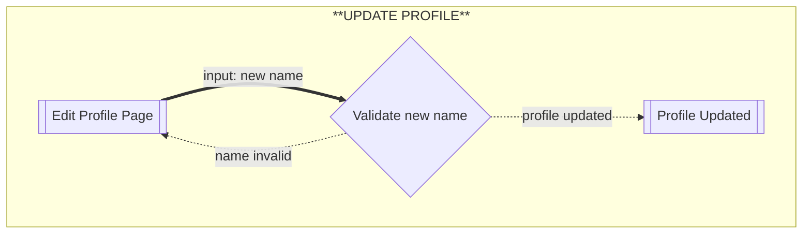
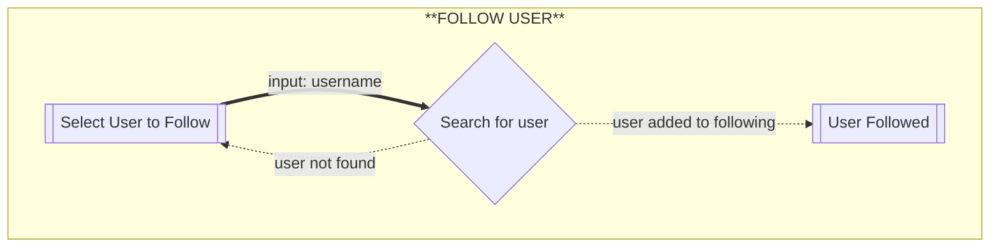
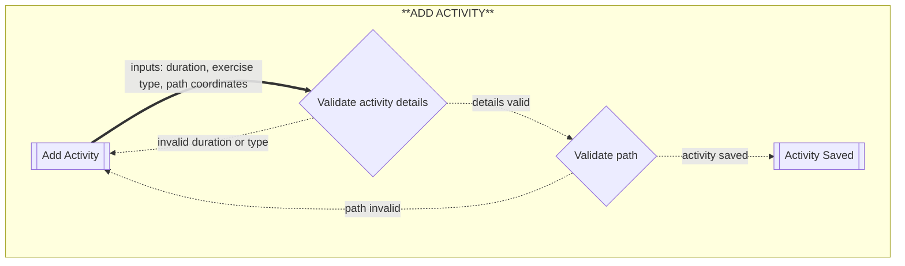
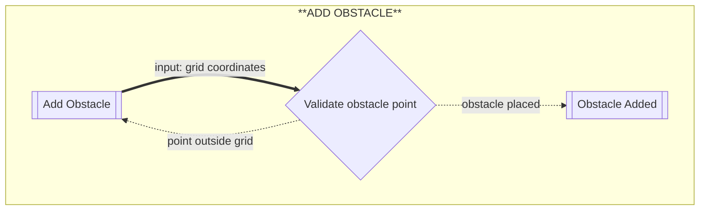
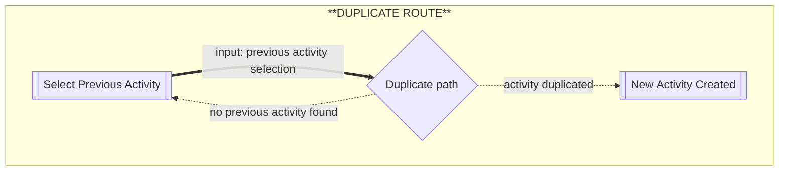
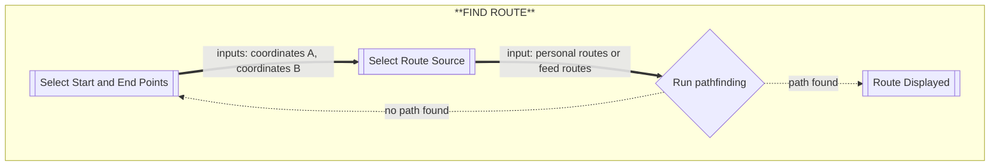
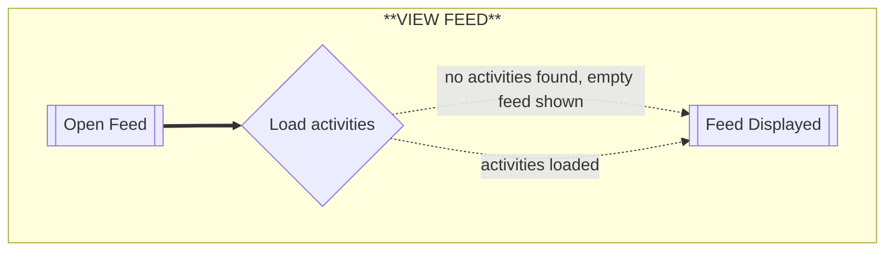

# Running

* The functional application can be started by running the `main` method in
  `Main.java` under `src/main/java/ca/umanitoba/cs/ekehcb/app/`.
* All tests can be run by running the `main` method in `TestHarness.java`
  under `src/test/java/ca/umanitoba/cs/ekehcb/`.

# Testing a stack

| method | data | expected outcome |
|---|---|---|
| `isEmpty()` | new stack | returns `true` |
| `isEmpty()` | after `push("a")` | returns `false` |
| `isEmpty()` | after push then pop | returns `true` |
| `size()` | new stack | returns `0` |
| `size()` | after 3 pushes | returns `3` |
| `size()` | after 2 pushes and 1 pop | returns `1` |
| `push()` | push one element | `size()` returns 1, `isEmpty()` returns false, `peek()` returns that element |
| `push()` | push two elements | `peek()` returns last pushed element |
| `peek()` | two elements on stack | returns top element without removing it, size unchanged |
| `peek()` | empty stack | throws exception |
| `pop()` | two elements on stack | returns top element |
| `pop()` | after pop | `size()` decreases by 1 |
| `pop()` | push three then pop all | returns elements in LIFO order |
| `pop()` | empty stack | throws exception |

## Why Ekeh is a bad programmer

* `BadStack1`
  * `isEmpty()` always returns `true` even after pushing elements, causing
    `pop()` and `peek()` to throw exceptions on a non-empty stack since they
    check `isEmpty()` before acting.
* `BadStack2`
  * `pop()` returns the top element correctly but does not actually remove it
    from the stack, so `size()` never decreases and LIFO order breaks after
    the first pop.
* `BadStack3`
  * `size()` always returns `0` regardless of how many elements have been
    pushed or popped. Everything else works correctly.
* `BadStack4`
  * `peek()` removes the top element instead of just returning it, violating
    the contract that `peek()` leaves the stack unchanged.
* `BadStack5`
  * No bugs found — this is the correct implementation.


## Flows of interaction

### Resources
- YouTube video -How to Create Flowcharts in Notion Using Mermaid (https://glasp.co/youtube/-XV1JBfhgWo)
- Mermaid -Flowcharts - Basic Syntax (https://mermaid.js.org/syntax/flowchart.html)
- Mermaid Viewer Docs-Flowchart (https://docs.mermaidviewer.com/diagrams/flowchart.html)


### Diagrams

#### SIGN IN / SELECT USER

```mermaid

flowchart
    subgraph **SIGN IN**
        start[[Start Application]]
        select[[Select User Profile]]
        validate{Validate user selection}
        home[[Home Screen]]

        start ==> select
        select ==input: user profile selection==> validate
        validate -. user not found .-> select
        validate -. profile loaded .-> home
    end
 ```

#### CREATE USER
```mermaid
flowchart
    subgraph **CREATE USER**
        start[[Create Profile]]
        validate{Validate name}
        save[[User Created]]

        start ==input: name==> validate
        validate -. name invalid .-> start
        validate -. user created .-> save
    end
```

### UPDATE PROFILE


### FOLLOW USER


### ADD ACTIVITY


### ADD OBSTACLE


### DUPLICATE ROUTE


### FIND ROUTE (PATHFINDING)


### VIEW FEED

# Domain model

### Resources
- Wikipedia -(Read–eval–print loop) https://en.wikipedia.org/wiki/Read%E2%80%93eval%E2%80%93print_loop
- YouTube video - (How to use Java REPL (Read-Eval-Print-Loop) https://www.youtube.com/watch?v=ad7NiCHpjgs
- YouTube video - (Stack Data Structure) https://www.youtube.com/watch?v=KcT3aVgrrpU
- Wikipedia - (Exception handling) https://en.wikipedia.org/wiki/Exception_handling
- Wikipedia - (Linked list) https://en.wikipedia.org/wiki/Linked_list
- Wikipedia - (Stack (abstract data type)) https://en.wikipedia.org/wiki/Stack_(abstract_data_type)
- COMP 2450 A01 Lecture notes and inclass activities.
### Changes

* I made the required updates as the feedback suggested which was using "Guava's Preconditions class instead of the built-in Java assertions for checking class invariants"
* I also separated my original printer class into 3 printer classes "Grid printer", "Activity Printer", "Obstacle Printer"
* I added a PathFinder class that uses the Stack for route calculation. 
* I updated the domain model diagram to include Stack, LinkedStack, StackNode, and PathFinder.
* I added the Stack interface and LinkedStack implementation to support the pathfinding algorithm.
* I added a following list to User to support following other users and building a feed, along with follow(), unfollow(), setName(), and getFollowing() methods
* I added a copy constructor Path(Path other) to support duplicating a previous route into a new activity 
* I added a ui/ package containing ConsoleUI.java to handle all user input and the command loop, separate from business logic 
* I added a service/ package containing UserService.java, ActivityService.java, and MapService.java to handle all application logic separately from the domain model and UI 
* I added custom exceptions/ package containing InvalidInputException, UserNotFoundException, ActivityNotFoundException, and PathNotFoundException to communicate specific errors between layers instead of using generic exceptions 
* I kept the output/ package separate from ui/ as the printer classes are only responsible for formatting and displaying data, which is a different responsibility from handling user input 
* I updated the domain model diagram to reflect the new following field in User and the new package structure

### Diagram

Here is the diagram for my domain model

```mermaid
---
config:
layout: dagre
look: classic
theme: default
themeVariables:
fontSize: 18px
---

classDiagram

%%========================
%% Stack 
%%========================
    class Stack {
        <<interface>>
        +push(data: Object): void
        +pop(): Object
        +peek(): Object
        +size(): int
        +isEmpty(): boolean
    }

    class LinkedStack {
        -StackNode top
        -int size
    }

    class StackNode {
        -Object data
        -StackNode next
    }

    Stack <|.. LinkedStack
    LinkedStack --> StackNode
    StackNode --> StackNode

%%========================
%% Core container
%%========================

    class ExerciseTypeTracker {
        - List~User~ users
        +registerUser(u: User): void
        +removeUser(u: User): void
    }

%%========================
%% Domain Entities
%%========================

    class User{
        -String name
        -List~Activity~ activities
        -List~User~ following
        +addActivity(a: Activity): void
        +removeActivity(a: Activity): void
        +follow(other: User): void
        +unfollow(other: User): void
        +setName(newName: String): void
        +getFollowing(): List~User~
    }

    class Activity {
        -int id
        -Path path
        -int duration
        -ExerciseType type
        -Grid grid
        +setDuration(minutes: int): void
    }

    class Path {
        -List~Point~ points
        +addPoint(p: Point): void
        +isEmpty(): bool
        +validateNotEmpty(): void
        +Path(other: Path)
    }

    class Point {
        -number pointX
        -number pointY
    }

    class Grid {
        -number width
        -number height
        -List~Point~ obstacles
        +addObstacle(p: Point): void
        +removeObstacle(id: int): void
        +isInside(p: Point): bool
        +isObstacle(p: Point): bool
    }

    class PathFinder {
        -stack Stack
        +findPath(grid: Grid, coveredPoints: Set, start: Point, end: Point): Path
    }

%%========================
%% Services
%%========================

    class UserService {
        -ExerciseTypeTracker tracker
        +createUser(name: String): User
        +selectUser(name: String): User
        +updateProfile(user: User, newName: String): void
        +followUser(currentUser: User, targetName: String): void
        +unfollowUser(currentUser: User, targetName: String): void
        +getAllUsers(): List~User~
    }

    class ActivityService {
        -Grid grid
        +addActivity(user: User, path: Path, duration: int, type: ExerciseType): Activity
        +duplicateRoute(user: User, activityId: int): Path
        +getFeed(user: User): List~Activity~
        +removeActivity(user: User, activityId: int): void
    }

    class MapService {
        -Grid grid
        -PathFinder pathFinder
        +addObstacle(point: Point): void
        +removeObstacle(id: int): void
        +findRoute(start: Point, end: Point, personalOnly: bool, user: User): Path
        +getGrid(): Grid
    }

%%========================
%% Exceptions
%%========================

    class InvalidInputException {
        <<exception>>
    }

    class UserNotFoundException {
        <<exception>>
    }

    class ActivityNotFoundException {
        <<exception>>
    }

    class PathNotFoundException {
        <<exception>>
    }

%%========================
%% Enumerations
%%========================

    class ExerciseType{
        <<enumeration>>
        RUN
        WALK
        BIKE
        SWIM
    }

%%========================
%% Relationships
%%========================

    ExerciseTypeTracker o-- User : Aggregate
    User *-- Activity : composition
    User o-- User : following
    Activity --> ExerciseType : uses
    Activity *-- Grid : composition
    Activity *-- Path : composition
    Path *-- Point : composition
    Grid o-- Point : aggregates
    PathFinder --> Stack
    PathFinder --> Grid
    PathFinder --> Path
    MapService --> PathFinder
    MapService --> Grid
    ActivityService --> Grid
    UserService --> ExerciseTypeTracker
    MapService ..> PathNotFoundException : throws
    MapService ..> InvalidInputException : throws
    UserService ..> UserNotFoundException : throws
    UserService ..> InvalidInputException : throws
    ActivityService ..> ActivityNotFoundException : throws
    ActivityService ..> InvalidInputException : throws

%%========================
%% Design-by-Contract (invariants)
%%========================

    note for Stack "Interface contract:
- push(data): pre: data != null; post: size increases by 1
- pop(): pre: isEmpty() == false; post: size decreases by 1
- peek(): pre: isEmpty() == false; post: returns top data, size unchanged
- size(): post: returns number of elements >= 0
- isEmpty(): post: returns true if size == 0"

    note for LinkedStack "Invariants:
- top == null if size == 0
- size >= 0
- No cycles in the node chain
- push(data): pre: data != null, post: size increases by 1, top is new node
- pop(): pre: size > 0, post: size decreases by 1, returns former top data
- peek(): pre: size > 0, post: size unchanged, returns top data"

    note for StackNode "Invariants:
- data != null
- next points to another StackNode or is null"

    note for ExerciseTypeTracker "
Invariants:
- users != null"

    note for User "
Invariants:
- name != null
- activities != null
- following != null

- addActivity(a): pre: a != null; post: activities includes a
- removeActivity(a): pre: activities contains a; post: activities does not contain a
- follow(other): pre: other != null, other != this, other not in following; post: following includes other
- unfollow(other): pre: other != null, other in following; post: following does not contain other
- setName(n): pre: n != null and not blank; post: name == n"

    note for Activity "
Invariants:
- id >= 0
- duration > 0
- path != null
- type != null
- grid != null

- setDuration(minutes): pre: minutes > 0; post: duration == minutes"

    note for Path "
Invariants:
- points != null

- addPoint(p): pre: p != null; post: points includes p
- validateNotEmpty(): pre: points.size() >= 1
- Path(other): pre: other != null; post: points == copy of other.points"

    note for Point "
Invariants:
- pointX >= 0
- pointY >= 0"

    note for Grid "
Invariants:
- width > 0
- height > 0
- obstacles != null

- addObstacle(p): pre: p != null AND isInside(p); post: obstacles includes p
- removeObstacle(id): pre: id >= 0 AND id < obstacles.size(); post: obstacles does not contain removed point"

    note for PathFinder "
Invariants:
- stack != null

- findPath(): pre: grid != null, start != null, end != null, coveredPoints != null,
  grid.isInside(start), grid.isInside(end)
- findPath(): post: returns Path if one exists, null if no path found"

    note for UserService "
- createUser(): pre: name not blank, name not taken; post: user registered in tracker
- selectUser(): pre: name matches existing user; post: returns that user
- followUser(): pre: target exists, not self, not already following; post: currentUser follows target
- unfollowUser(): pre: target exists, currently following; post: currentUser no longer follows target"

    note for ActivityService "
- addActivity(): pre: path not empty, duration > 0; post: activity added to user
- duplicateRoute(): pre: activityId matches user activity; post: returns copy of that path
- removeActivity(): pre: activityId matches user activity; post: activity removed from user"

    note for MapService "
- addObstacle(): pre: point inside grid, not already obstacle; post: obstacle added
- removeObstacle(): pre: id valid; post: obstacle removed
- findRoute(): pre: start and end inside grid; post: returns Path or throws PathNotFoundException"

```


