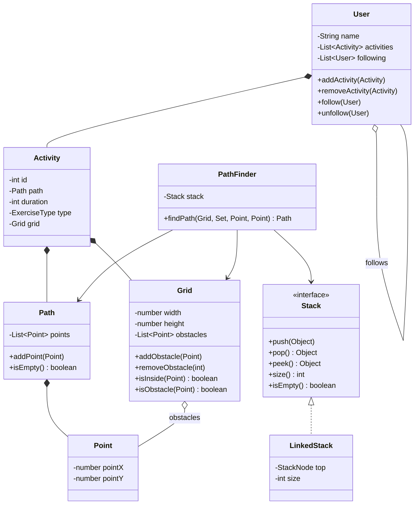

# 🏃 Exercise Tracker

A Java-based exercise tracking application for creating user profiles, recording activities, following other users, managing exercise routes, and finding paths through a grid-based map.

The project demonstrates **object-oriented programming, layered architecture, custom data structures, pathfinding, exception handling, and software testing**.

---

## ✨ Features

- Create and select user profiles
- Update user profile information
- Record exercise activities
- Support multiple exercise types: running, walking, biking, and swimming
- Follow and unfollow other users
- View activities from followed users in an activity feed
- Create routes using grid coordinates
- Duplicate routes from previous activities
- Add and remove obstacles from the map
- Find routes between two points using pathfinding
- Validate user input and application state
- Handle application errors with custom exceptions

---

## 🛠️ Technologies & Concepts

- **Java**
- **Maven**
- **Google Guava**
- Object-Oriented Programming
- Layered Architecture
- Design by Contract
- Data Structures
- Pathfinding
- Exception Handling
- Software Testing
- Mermaid

---

## 🏗️ Project Architecture

The application separates user interaction, business logic, domain objects, and output formatting into different components.

```text
Exercise Tracker
│
├── Application
│   └── Main
│
├── UI
│   └── ConsoleUI
│
├── Services
│   ├── UserService
│   ├── ActivityService
│   └── MapService
│
├── Domain
│   ├── ExerciseTypeTracker
│   ├── User
│   ├── Activity
│   ├── Path
│   ├── Point
│   ├── Grid
│   └── ExerciseType
│
├── Pathfinding
│   └── PathFinder
│
├── Data Structures
│   ├── Stack
│   ├── LinkedStack
│   └── StackNode
│
├── Output
│   ├── GridPrinter
│   ├── ActivityPrinter
│   └── ObstaclePrinter
│
└── Exceptions
    ├── InvalidInputException
    ├── UserNotFoundException
    ├── ActivityNotFoundException
    └── PathNotFoundException
```

### Layered Design

The application is organized so that each part has a clear responsibility:

- **UI Layer** — handles user input and the console command loop.
- **Service Layer** — handles application and business logic.
- **Domain Layer** — represents users, activities, paths, grids, and other core objects.
- **Output Layer** — formats and displays application data.
- **Exception Layer** — provides application-specific error handling.

This structure keeps business logic separate from user interaction and output formatting.

---

## 🏃 Exercise Activities

Users can create activities containing:

- An exercise type
- Duration
- A route represented by a `Path`
- Grid information

Supported exercise types include:

```text
RUN
WALK
BIKE
SWIM
```

Users can also duplicate routes from previous activities.

---

## 👥 Social Features

Users can follow other users in the application.

Each `User` maintains a list of followed users, allowing the application to build an activity feed containing activities from those users.

The application supports:

- Following users
- Unfollowing users
- Viewing followed users
- Viewing an activity feed

---

## 🗺️ Route & Map System

Exercise routes are represented using a collection of `Point` objects.

```text
Path
 └── Point
     ├── X coordinate
     └── Y coordinate
```

The `Grid` represents the map and keeps track of obstacles.

Coordinates are validated to ensure they are inside the grid before they are used.

---

## 🧭 Pathfinding

The project includes a `PathFinder` responsible for finding a route between a start point and an end point while accounting for the grid and its obstacles.

```text
Start Point
     │
     ▼
Check Grid
     │
     ▼
Explore Available Points
     │
     ▼
Avoid Obstacles
     │
     ▼
Find Destination
     │
     ▼
Return Path
```

The pathfinding functionality uses the project's custom `Stack` implementation during route calculation.

---

## 📚 Custom Stack

A custom stack data structure was implemented rather than relying entirely on Java's built-in data structures.

The `Stack` interface supports:

```java
push(data)
pop()
peek()
size()
isEmpty()
```

`LinkedStack` implements the interface using linked `StackNode` objects.

```text
Stack
  ▲
  │ implements
  │
LinkedStack
  │
  ▼
StackNode → StackNode → StackNode
```

The stack follows **LIFO (Last In, First Out)** behavior.

---

## 📐 Design by Contract

The project uses class invariants, preconditions, and postconditions to help maintain valid application state.

Google Guava's `Preconditions` are used for validation.

Examples of application rules include:

- User names cannot be null or blank.
- Activities must have a duration greater than zero.
- Paths cannot contain null points.
- Grid dimensions must be greater than zero.
- Obstacles must be placed inside the grid.
- Stack size cannot be negative.
- Users cannot follow themselves.
- Users cannot follow the same user more than once.

---

## ⚠️ Custom Exceptions

Application-specific exceptions are used to communicate errors between different layers of the program.

```text
InvalidInputException
UserNotFoundException
ActivityNotFoundException
PathNotFoundException
```

This allows different types of application errors to be handled explicitly instead of relying only on generic exceptions.

---

## 📊 Simplified Domain Model



---

## ▶️ Running the Application

### Requirements

Make sure you have **Java** installed.

### Running in IntelliJ IDEA

1. Clone or download the repository.
2. Open the project in IntelliJ IDEA.
3. Navigate to:

```text
src/main/java/ca/umanitoba/cs/ekehcb/app/Main.java
```

4. Run the `main` method.
5. Use the console interface to interact with the application.

---

## 🧪 Testing

The project includes tests for application functionality and the custom stack implementation.

All tests can be run using the `main` method in:

```text
src/test/java/ca/umanitoba/cs/ekehcb/TestHarness.java
```

The stack tests cover:

- Creating an empty stack
- Pushing elements
- Popping elements
- Peeking at the top element
- Checking stack size
- Checking whether the stack is empty
- LIFO ordering
- Error handling for invalid stack operations

---

## 💡 What I Learned

Building this project gave me practical experience with:

- Designing Java applications using object-oriented principles
- Separating application logic into multiple layers
- Creating and implementing interfaces
- Implementing a linked data structure from scratch
- Working with composition and aggregation
- Implementing pathfinding logic
- Applying class invariants and preconditions
- Creating custom exceptions
- Testing data structures and application behavior
- Refactoring code to improve separation of concerns

---

## 🚀 Future Improvements

Possible future improvements include:

- Graphical user interface
- Persistent storage for users and activities
- User authentication
- Exercise statistics and progress tracking
- Route visualization
- More advanced pathfinding algorithms
- Activity search and filtering
- REST API support

---

## 👨‍💻 Author

**Chukwuemeka Ekeh**

Computer Science  
University of Manitoba